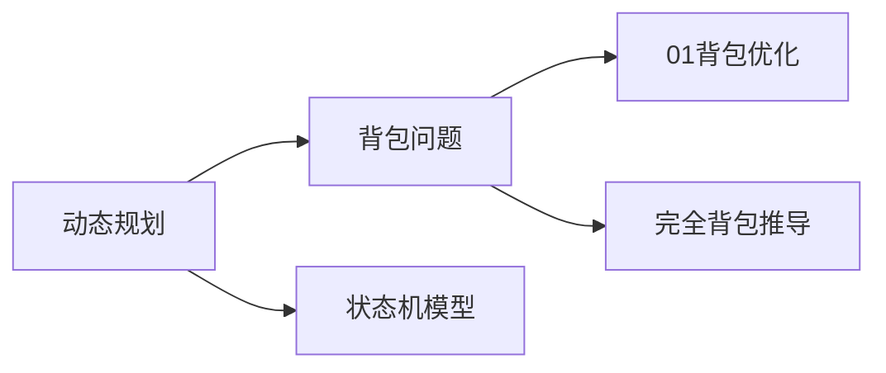

<!-- 顶部动态徽章 -->
<div align="center">

# 🚀 Algorithm Mastery Notebook

[](https://github.com/StayOne1/Notes/stargazers)
[](https://github.com/StayOne1/Notes/issues)
[](https://github.com/StayOne1/Notes/tree/main/LICENSE)


</div>

---

## 🌌 项目全景 (Project Vision)
```text
█████ 算法宇宙 ████████████████████████████
█                                                        █
█  用代码绘制星辰大海  丨  以逻辑破解数据奥秘              █
█  系统性攻克LeetCode/Codeforces/AcWing等平台经典题目     █
█  涵盖15+算法分类，300+精选题解                        █
█                                                        █
█████████████████████████████████████████████████████
```

---

### 🛠️ 技术栈 (Tech Stack)
<p align="left">
  
  
  
  
</p>

---

## 🧠 核心特性 (Features)
<details>
<summary><strong>📂 结构化知识体系</strong></summary>

```bash
├── 数据结构
│   ├── 链表
│   ├── 树与图
│   └── 高级数据结构
├── 算法范式
│   ├── 分治策略
│   ├── 动态规划
│   └── 贪心算法
└── 专项突破
    ├── 位运算技巧
    ├── 几何问题
    └── 数学方法
```
</details>

<details>
<summary><strong>🎯 题解要素规范</strong></summary>

每篇题解包含：
```markdown
- 复杂度分析
- 多种解法对比
- 测试用例设计
- 可视化推导
- 相关题目延伸
```
</details>

---

## 🖥️ 快速开始 (Quick Start)
```bash
# 克隆仓库
git clone https://github.com/yourname/algorithm-notebook.git

# 启动Jupyter Lab
jupyter lab
```

---

## 🌐 知识图谱 (Knowledge Graph)


---

## 🧪 算法实验室 (Algorithm Lab)
```python
def binary_search(arr, target):
    left, right = 0, len(arr)-1
    while left <= right:
        mid = (left + right) // 2
        if arr[mid] == target:
            return mid
        elif arr[mid] < target:
            left = mid + 1
        else:
            right = mid - 1
    return -1
```

---

## 🤝 贡献指南 (Contributing)
1. Fork 本仓库
2. 创建特性分支 (`git checkout -b feature/AmazingFeature`)
3. 提交修改 (`git commit -m 'Add some AmazingFeature'`)
4. 推送分支 (`git push origin feature/AmazingFeature`)
5. 发起 Pull Request

---

## 📜 许可证 (License)
[MIT License](LICENSE)

---

<div align="center">
<br>
<a href="https://github.com/yourname/algorithm-notebook">
  
</a>
</div>